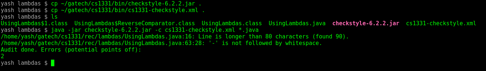

# CS1331-Checkstyle
---
##### A Guide to setup checkstyle for the CS1331 course at Georgia Tech. It will go over how to download and use checkstyle along with how to make aliases on Linux, Windows, or Mac.

**At this point you should have Java installed and working on your computer. If not, go through the Java installation guide found [here](http://cs1331.org/resources.html)**

Checkstyle is a style guide used in CS1331 to make sure that you are writing code that is readable and follows standard coding conventions. It scans through your code and lets you know of any style errors that you've made so that you can fix them. All homework that you submit should be run through checkstyle first because we take points off for checkstyle errors.

It is run through the terminal(*nix systems like Mac and Linux) or through the command prompt/powershell (Windows).

You will see the word 'directory' be used in this document frequently. A directory is just the technical term for a folder on your computer. If asked to make a directory, you just need to create a new folder.

### Download Checkstyle

  - [Checkstyle-6.2.2.jar](http://cs1331.org/resources/checkstyle-6.2.2.jar)

##### Where should you place this file?

We suggest that you create a folder called `cs1331` somewhere easily accessible (for e.g. C:\cs1331 on windows or /home/username/cs1331 on *nix).

Create a folder named `bin` in your `cs1331` folder and save the checkstyle jar file there.

When your next homework is assigned, you should do the following:

1. Download the zip file of the homework
2. Place the zip file in the `cs1331` folder and unzip it
3. You should now have a folder names something like `cs1331/hw-homeworkname-master`
4. Copy the checkstyle jar file from `bin` to the hw folder

##### How do I use checkstyle on my homework?

Checkstyle needs to be run on java source code. So, if you haven't created or written your .java files yet, you have to do so first.

*Hint:* you will need to create some directories in your hw folder to put the java files in if they are not already present

Navigate to your hw root directory. The hw root directory is the top directory of your homework - it is where you placed the checkstyle jar file (`cs1331/hw-homeworkname-master` is the root directory in this case).

From the hw root directory, you will have to create a directory named `src`, navigate into it and then create a directory named `main`, navigate into `main` and then create another directory named `java`. You will place your java files in this `java` folder.

You can do this from the command-line (for all operating systems) by executing the following commands:

```Batchfile
cd /home/username/cs1331/ #or wherever your cs1331 folder is placed
cd hw-homeworkname-master
mkdir src
cd src
mkdir main
cd main
mkdir java
cd java
```

So now, you have `cs1331/hw-homeworkname-master/src/main/java/` with java files inside it.

To run checkstyle, go to your hw root directory (again, this is the directory that contains the checkstyle file)

Run the command:

```Batchfile
java -jar checkstyle-6.2.2.jar src/main/java/*.java
```

The `java -jar` part means that I'm executing a .jar file. Then I give it the filename. Then I tell it what files I want it to check. `src/main/java/*.java` means all the java files in `src/main/java/`

Here is what it looks like if you have some checkstyle errors (Don't worry about what these errors mean right now)



After going through my code and fixing all the errors, I run checkstyle again to make sure there are no more errors


**We take one point off your homework for each checkstyle error, so make sure you run checkstyle before submitting!**

