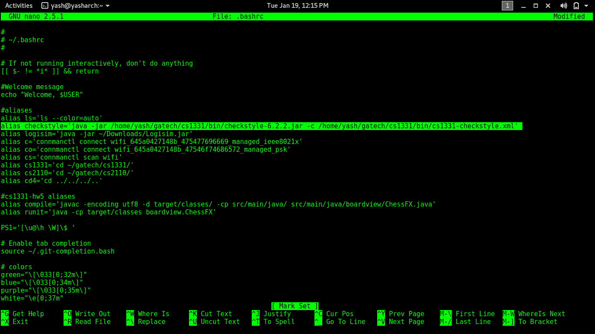

# CS1331-Checkstyle
---
##### A Guide to setup checkstyle for the CS1331 course at Georgia Tech. It will go over how to download and use checkstyle along with how to make aliases on Linux, Windows, or Mac.

**At this point you should have Java installed and working on your computer. If not, go through the Java installation guide found [here](http://cs1331.org/resources.html)**

Checkstyle is a style guide used in CS1331 to make sure that you are writing code that is readable and follows standard coding conventions. It scans through your code and lets you know of any style errors that you've made so that you can fix them. All homework that you submit should be run through checkstyle first because we take points off for checkstyle errors.

It is run through the terminal(\*nix systems like Mac and Linux) or through the command prompt/powershell (Windows).

You will see the word 'directory' be used in this document frequently. A directory is just the technical term for a folder on your computer. If asked to make a directory, you just need to create a new folder.

### Download Checkstyle

  - [Checkstyle-6.2.2.jar](http://cs1331.org/resources/checkstyle-6.2.2.jar)

##### Where should you place this file?

We suggest that you create a folder called `cs1331` somewhere easily accessible (for e.g. C:\cs1331 on windows or /home/username/cs1331 on *nix).

Create a folder named `bin` in your `cs1331` folder and save the checkstyle jar file there.

When your next homework is assigned, you should copy the checkstyle file from the bin folder and paste it into your homework folder along with the .java files.

### Run Checkstyle

Checkstyle needs to be run on java source code. So, if you haven't created or written your .java files yet, you have to do so first.

Place the checkstyle file in the same directory as the code (.java files) and from the command-line, execute the following command:

`java -jar checkstyle-6.2.2.jar *.java`

The `java -jar` part means that I'm executing a .jar file. Then I give it the checkstyle file. Then I tell it what files I want it to check. `*.java` means all the java files in the current directory.
Make sure that you have already navigated to the directory where your code is before you run checkstyle.

Here is what it looks like if you have some checkstyle errors (Don't worry about what these errors mean right now)  

After going through my code and fixing all the errors, I run checkstyle again to make sure there are no more errors  

**We take one point off your homework for each checkstyle error, so make sure you run checkstyle before submitting!**

## Aliases

That is a very long command and a long process. You're probably going to have to open this guide and copy/paste it every time you want to use it. That's a little less than ideal isn't it? And who wants to remember to copy the checkstyle file into each homework directory? You're a computer science student - you're always looking for ways to do less work!

Well, we can shorten this whole process down. In fact, you can run checkstyle on any of your code in any directory by simply typing in the following command:

`checkstyle *.java`

Isn't that so much easier?

Here's how to do it.

### Linux / Mac (\*nix systems)

1. Open the terminal
2. Type `cd` and hit enter. This navigates to your home directory.
3. Type in `nano .bashrc` for Linux or `nano .bash_profile` for Mac
4. Go to the end of this file and add this line to it

 `alias checkstyle='java -jar /home/username/cs1331/bin/checkstyle-6.2.2.jar'`

 remember to replace the directory here with wherever your cs1331 directory is.

5. Save and close the file (Ctrl-X closes the file in nano. Then hit Y when it asks whether you want to save it, and then hit enter to confirm). Restart the terminal, and you're done!

(If it didn't work, try adding the same line in `~/.bash_profile` instead of `~/.bashrc` or vice-versa)

Screenshots of the process:

* Open terminal. You can see that my checkstyle alias is not set yet.  
  

* Open ~/.bashrc. Yours will probably look different. Add the checkstyle alias into the file.  
  

* Save and close the file. Restart terminal. Now checkstyle alias is set. *Note: you still have to tell checkstyle what file to check or it will complain like it did in the screeshot*  
  

### Windows

There are many ways to access a terminal in windows. The ways to make aliases with the default command-prompt and with powershell are very complicated and will not be shown here. (You could Google them and figure out how to do them if you want).

Aliasing in Windows can be done easily if you use git bash as your terminal. Here's how:

1. Open git bash
2. Type the command `cd` and hit enter. This navigates to your home directory.
3. Type in `touch .bashrc` (touch will create the file)
4. Type in `nano .bashrc` (this will let you edit the file)
5. Type in `alias checkstyle='java -jar /c/cs1331/bin/checkstyle-6.2.2.jar'`
6. Type Ctrl-X to save and type 'Y' to confirm and then enter to exit.
7. Restart git bash and you're done!

If it didn't let you create the file in step 3, then try the command `touch .bashrc.` - Windows will remove the dot at the end by itself.

If it didn't work, try again with `.bash_profile` instead of `.bashrc`

Screenshots of the process:

* Open git bash, navigate to home and create the file (in my case, I had to use `.bash_profile`)  

* Open the file in vim and add the alias  

* Save and close the file. Restart git bash and test whether it worked  

#### Now you know how to run checkstyle and how to make an alias so that it is easy to use!
